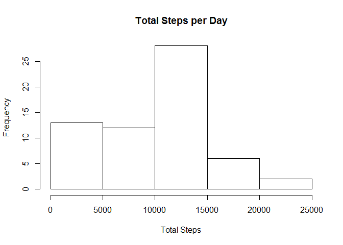
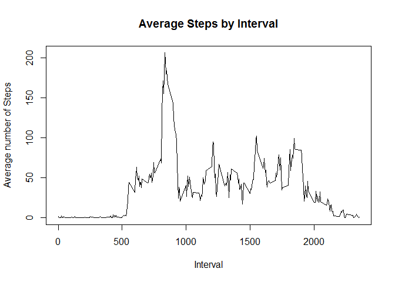
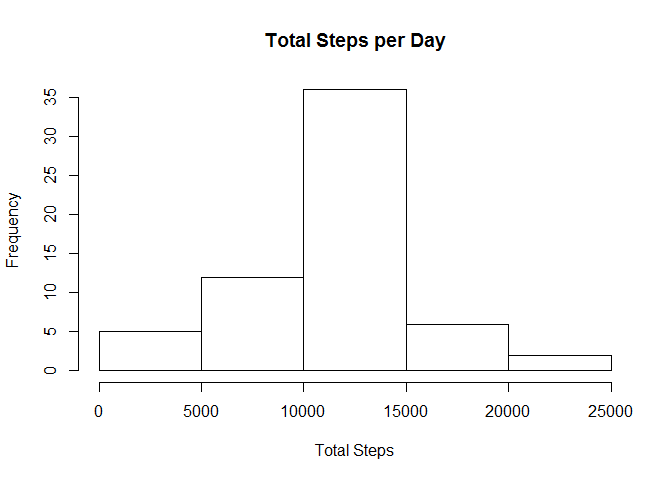
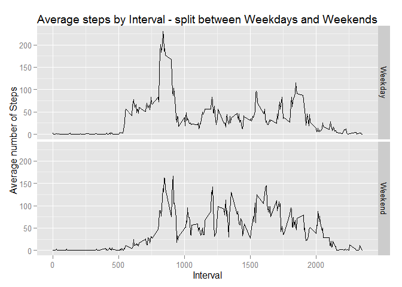

# Reproducible Research: Peer Assessment 1


## Loading and preprocessing the data

```r
unzip('activity.zip', 'activity.csv')
activity_raw <- read.csv('activity.csv')
```

## What is mean total number of steps taken per day?

```r
activity_totalSteps <- summarise(group_by(activity_raw, date), totalSteps = sum(steps, na.rm = TRUE))
hist(activity_totalSteps$totalSteps, main="Total Steps per Day", xlab = "Total Steps")
```



```r
mean_total <- mean(activity_totalSteps$totalSteps)
median_total <- median(activity_totalSteps$totalSteps)
```
Mean of total steps is **9354.2295082**. Median of total steps is **10395**.

## What is the average daily activity pattern?

```r
activity_avgSteps <- summarise(group_by(activity_raw, interval), avgSteps = mean(steps, na.rm = TRUE))
plot(activity_avgSteps$interval, activity_avgSteps$avgSteps, type = "l", 
     main = "Average Steps by Interval", xlab = "Interval", ylab = "Average number of Steps")
```



```r
maxInterval <- activity_avgSteps[activity_avgSteps$avgSteps == max(activity_avgSteps$avgSteps), "interval"][[1]]
```
Interval **835** has the highest average number of steps.

## Imputing missing values

```r
noOfNARows <- nrow(activity_raw[is.na(activity_raw$steps),])
```
There are a total of **2304** rows with missing values.

*To eliminate totally missing values, any interval with a missing value is replaced with the mean number of steps
for that interval.*

First, all missing values are replaced with the mean number of steps, by merging the NA Rows with the 
activity_avgSteps dataset

```r
activity_NAs <- activity_raw[is.na(activity_raw$steps),]
activity_NAsWithMean <- merge(activity_NAs, activity_avgSteps, by.x = "interval", by.y = "interval")
```

Next, union all rows having a value with activity_NAswithMean, to have a complete dataset

```r
names(activity_NAsWithMean) <- c('interval', 'NAsteps', 'date', 'steps')
activity_complete <- rbind(activity_raw[!is.na(activity_raw$steps),], select(activity_NAsWithMean, interval, steps, date))
```

Plot the complete results

```r
activityComplete_totalSteps <- summarise(group_by(activity_complete, date), totalSteps = sum(steps))
hist(activityComplete_totalSteps$totalSteps, main="Total Steps per Day", xlab = "Total Steps")
```



```r
meanComplete_total <- as.integer(mean(activityComplete_totalSteps$totalSteps))
medianComplete_total <- as.integer(median(activityComplete_totalSteps$totalSteps))
```
The mean total number of steps for the complete data set is **10766**.  
The median total number of steps for the complete data set is **10766**.

Since the mean number of steps per interval was used to replace the missing values, the frequency of the
most common number of total steps have increased. Using this approach also affected the mean and median
values, which now amount to the same number.

## Are there differences in activity patterns between weekdays and weekends?
Add a factor to distinguish between weekdays and weekends

```r
activityComplete_weekdays <- cbind(activity_complete, weekdays(as.Date(activity_complete$date), TRUE))
names(activityComplete_weekdays)[4] <- 'day'
activityComplete_weekdays$weekend <- 'Weekday'
activityComplete_weekdays[activityComplete_weekdays$day == 'Sat' | activityComplete_weekdays$day == 'Sun',]$weekend <- 'Weekend'
activityComplete_weekdays$weekend <- as.factor(activityComplete_weekdays$weekend)
```

Plot the results

```r
activityWeekends_Interval <- summarise(group_by(activityComplete_weekdays, interval, weekend), 
                                       avgSteps = mean(steps))
g <- ggplot(activityWeekends_Interval, aes(interval, avgSteps))
g + geom_line() + facet_grid(weekend ~ .) +
    ggtitle('Average steps by Interval - split between Weekdays and Weekends') +
    xlab('Interval') + ylab('Average number of Steps')
```


